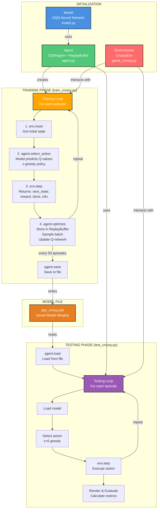

```mermaid
graph TB
    subgraph Init["INITIALIZATION"]
        Model[Model<br/>DQN Neural Network<br/>model.py]
        Agent[Agent<br/>DQNAgent + ReplayBuffer<br/>agent.py]
        Env[Environment<br/>CrossyEnv<br/>game_crossy.py]
        Model -->|uses| Agent
    end
    
    subgraph Train["TRAINING PHASE (train_crossy.py)"]
        TrainLoop[Training Loop<br/>For each episode]
        Step1[1. env.reset<br/>Get initial state]
        Step2[2. agent.select_action<br/>Model predicts Q-values<br/>ε-greedy policy]
        Step3[3. env.step<br/>Returns: next_state,<br/>reward, done, info]
        Step4[4. agent.optimize<br/>Store in ReplayBuffer<br/>Sample batch<br/>Update Q-network]
        Save[agent.save<br/>Save to file]
        
        TrainLoop --> Step1
        Step1 --> Step2
        Step2 --> Step3
        Step3 --> Step4
        Step4 -->|repeat| TrainLoop
        Step4 -->|every 50 episodes| Save
    end
    
    subgraph File["MODEL FILE"]
        ModelFile[dqn_crossy.pth<br/>Saved Model Weights]
    end
    
    subgraph Test["TESTING PHASE (test_crossy.py)"]
        Load[agent.load<br/>Load from file]
        TestLoop[Testing Loop<br/>For each episode]
        TestStep1[Load model]
        TestStep2[Select action<br/>ε=0 greedy]
        TestStep3[env.step<br/>Execute action]
        TestStep4[Render & Evaluate<br/>Calculate metrics]
        
        Load --> TestLoop
        TestLoop --> TestStep1
        TestStep1 --> TestStep2
        TestStep2 --> TestStep3
        TestStep3 -->|repeat| TestLoop
        TestStep3 --> TestStep4
    end
    
    Agent -->|creates| TrainLoop
    Env -->|interacts with| TrainLoop
    Save -->|writes| ModelFile
    ModelFile -->|reads| Load
    Agent -->|uses| TestLoop
    Env -->|interacts with| TestLoop
    
    style Model fill:#4A90E2,stroke:#333,stroke-width:2px,color:#fff
    style Agent fill:#50C878,stroke:#333,stroke-width:2px,color:#fff
    style Env fill:#FF6B6B,stroke:#333,stroke-width:2px,color:#fff
    style TrainLoop fill:#FFA500,stroke:#333,stroke-width:2px,color:#fff
    style TestLoop fill:#9B59B6,stroke:#333,stroke-width:2px,color:#fff
    style ModelFile fill:#E67E22,stroke:#333,stroke-width:2px,color:#fff
```
